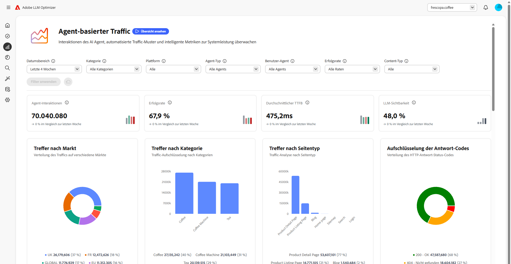
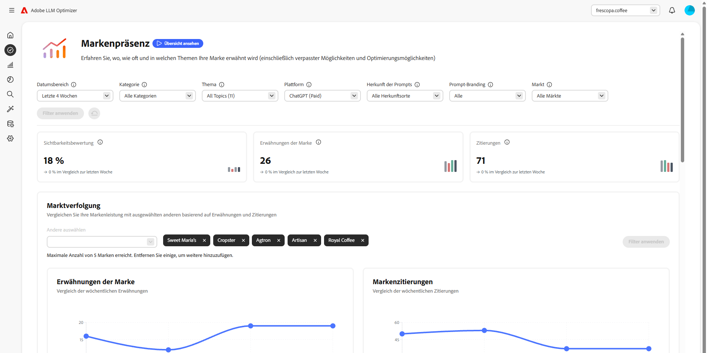
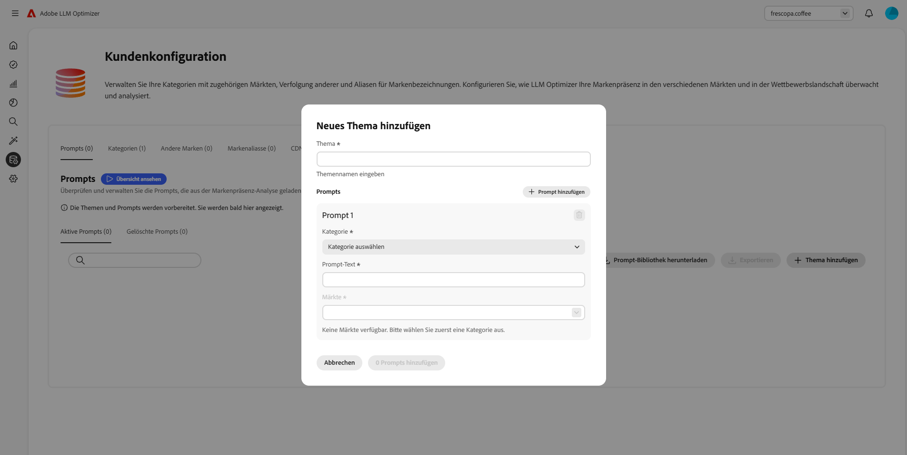
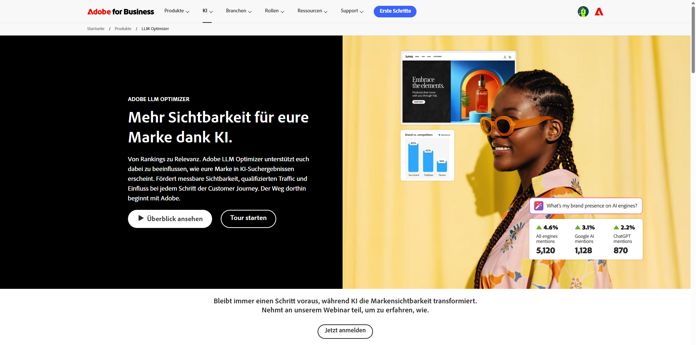

# Adobe LLM Optimizer

<!-- VIDEO HERE/SLIDES HERE -->

Adobe LLM Optimizer ist eine generative KI-First-Anwendung für die Optimierung generativer Suchmaschinen, mit der Marken ihre Sichtbarkeit, Genauigkeit und ihren Einfluss in KI-gestützten Suchumgebungen verbessern können. Es bietet Einblicke in die Markenpräsenz in KI-generierten Antworten, bietet präskriptive Inhaltsempfehlungen und automatisiert Optimierungskorrekturen.

## Erste Schritte mit LLM Optimizer

<!-- CARDS

* ./overview/quick-start.md
  {title= Quickstart guide}
  {description= Learn how to quickly get up and running with the LLM Optimizer.}
  {image= ./assets/overview/agentic-traffic-card.png}
  {target=_blank}
  {cta=Learn more}
* ./dashboards/dashboards-overview.md
  {title= Dashboards overview}
  {image= ./assets/overview/brand-presence-card.png}
  {description= Learn how to get insights and get recommendations for your site with dashboards.}
  {target=_blank}
  {cta=Learn more}
-->
<!-- START CARDS HTML - DO NOT MODIFY BY HAND -->

    

        

            

                <figure class="image x-is-16by9">
                    
                </figure>
            

            

                

                    

                        <a href="./overview/quick-start.md" target="_blank" rel="referrer" title="Schnellstartanleitung">Schnellstartanleitung</a>
                    

                    
Erfahren Sie, wie Sie mit der LLM Optimizer schnell loslegen können.

                

                <a href="./overview/quick-start.md" target="_blank" rel="referrer" class="spectrum-Button spectrum-Button--outline spectrum-Button--primary spectrum-Button--sizeM" style="align-self: flex-start; margin-top: 1rem;">
                    Weitere Informationen
                </a>
            

        

    

    

        

            

                <figure class="image x-is-16by9">
                    
                </figure>
            

            

                

                    

                        <a href="./dashboards/dashboards-overview.md" target="_blank" rel="referrer" title="Dashboards - Übersicht">Dashboards - Übersicht</a>
                    

                    
Erfahren Sie, wie Sie mit Dashboards Erkenntnisse und Empfehlungen für Ihre Site erhalten.

                

                <a href="./dashboards/dashboards-overview.md" target="_blank" rel="referrer" class="spectrum-Button spectrum-Button--outline spectrum-Button--primary spectrum-Button--sizeM" style="align-self: flex-start; margin-top: 1rem;">
                    Weitere Informationen
                </a>
            

        

    

<!-- END CARDS HTML - DO NOT MODIFY BY HAND -->

## Weitere Informationen zu LLM Optimizer

<!-- Add cards -->

<!-- CARDS

* ./tutorials/best-practices.md
  {title= Best practices for marketers and SEO analysts}
  {image= ./assets/overview/best-practices-card.png}
  {description= Learn how LLM Optimizer can help you drive brand authority in AI search and discovery.}
* https://business.adobe.com/products/llm-optimizer.html
  {title = Explore the capabilities of the Adobe LLM Optimizer}
  {image = ./assets/overview/business-adobe.png}
  {target=_blank}
  {cta=Learn more}

-->
<!-- START CARDS HTML - DO NOT MODIFY BY HAND -->

    

        

            

                <figure class="image x-is-16by9">
                    
                </figure>
            

            

                

                    

                        <a href="./tutorials/best-practices.md" target="_blank" rel="referrer" title="Best Practices für Marketing-Experten und SEO-Analysten">Best Practices für Marketing-Experten und SEO-Analysten</a>
                    

                    
Erfahren Sie, wie LLM Optimizer Sie bei der Stärkung der Markenautorität bei der Suche und Erkennung von KI unterstützen kann.

                

                <a href="./tutorials/best-practices.md" target="_blank" rel="referrer" class="spectrum-Button spectrum-Button--outline spectrum-Button--primary spectrum-Button--sizeM" style="align-self: flex-start; margin-top: 1rem;">
                    Weitere Informationen
                </a>
            

        

    

    

        

            

                <figure class="image x-is-16by9">
                    
                </figure>
            

            

                

                    

                        <a href="https://business.adobe.com/products/llm-optimizer.html" target="_blank" rel="referrer" title="Erkunden der Funktionen von Adobe LLM Optimizer">Erkunden Sie die Funktionen von Adobe LLM Optimizer</a>
                    

                    
Erhöhen Sie mit Adobe LLM Optimizer die Sichtbarkeit bei der KI-gesteuerten Suche. Optimieren Sie Inhalte für generative Suche und Erkennung großer Sprachmodelle (LLM), um die Ergebnisse zu steigern.

                

                <a href="https://business.adobe.com/products/llm-optimizer.html" target="_blank" rel="referrer" class="spectrum-Button spectrum-Button--outline spectrum-Button--primary spectrum-Button--sizeM" style="align-self: flex-start; margin-top: 1rem;">
                    Weitere Informationen
                </a>
            

        

    

<!-- END CARDS HTML - DO NOT MODIFY BY HAND -->

## Verweise

Referenzlinks sollten hier angezeigt werden.
